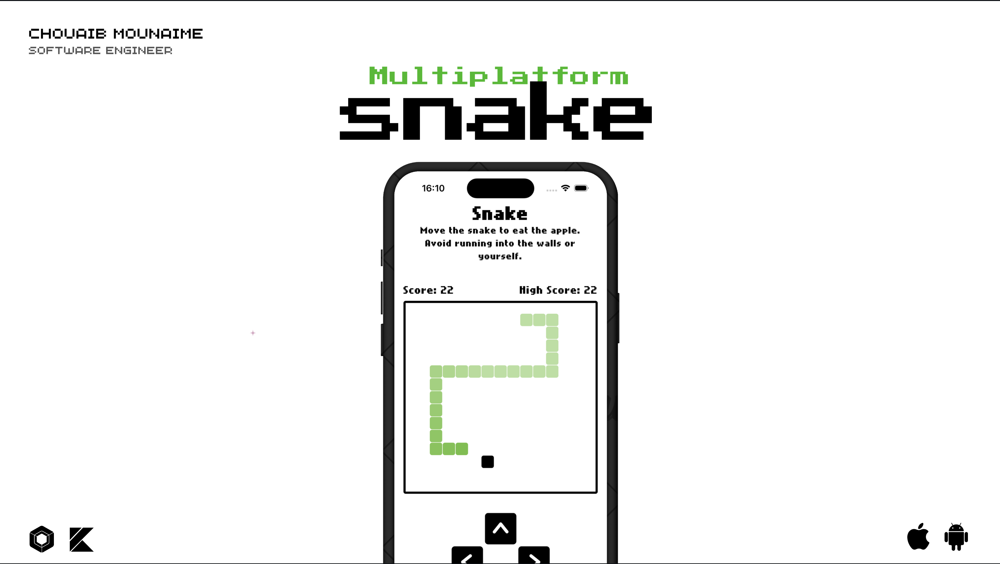
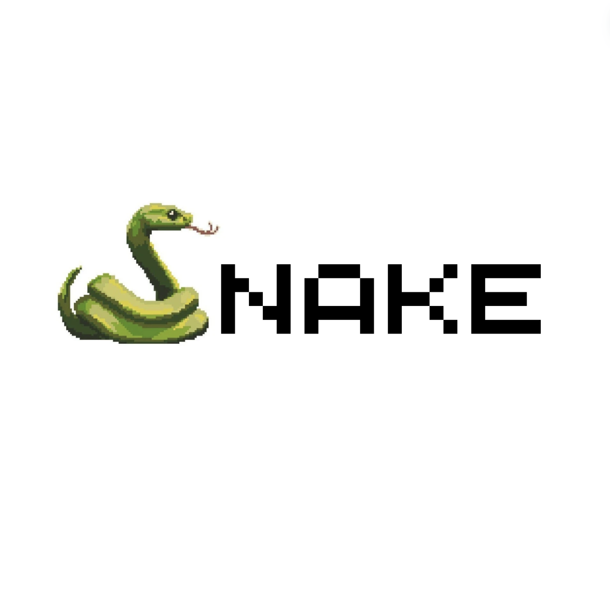

<p> 
  
</p>

<a href="https://github.com/chouaibMo/">

</a>

## 💡 Description
A multiplatform Snake game built with Jetpack Compose Multiplatform, inspired by the classic Snake game.

## 📱 Supported platforms
this project supports the following platforms:
* Android
* iOS

Browser and desktop support are not available yet. It will be added in the future.
Note: the project is still in development and not all features are available on all platforms.

## ✨ Features
this project integrates the following features:
* Play the classic Snake game.
* Change direction using the arrow keys or swipe gestures.
* Pause and resume the game.
* High score counter.

## 🤝 Contribution
Most of the features are not completed. Feel free to contribute to this project by adding new features, fixing bugs, or improving the code quality.

## 💙 Find this repository useful?
Support it by staring and sharing it :star:

## 📜 License
```xml
Licensed under the Apache License, Version 2.0 (the "License");
you may not use this file except in compliance with the License.
You may obtain a copy of the License at

   http://www.apache.org/licenses/LICENSE-2.0

Unless required by applicable law or agreed to in writing, software
distributed under the License is distributed on an "AS IS" BASIS,
WITHOUT WARRANTIES OR CONDITIONS OF ANY KIND, either express or implied.
See the License for the specific language governing permissions and
limitations under the License.
```